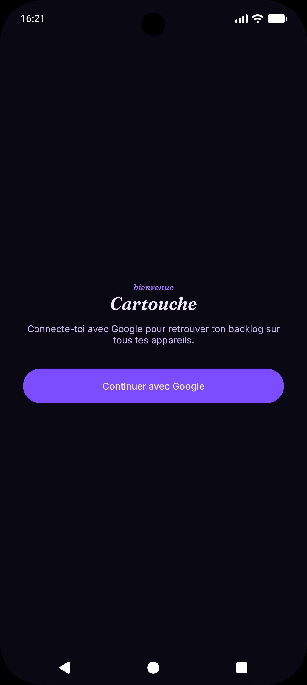
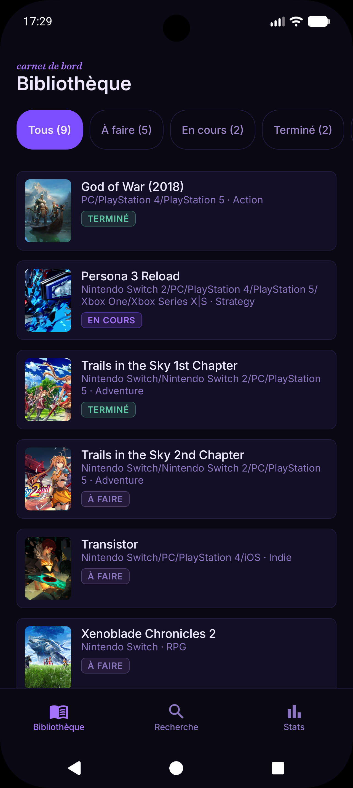
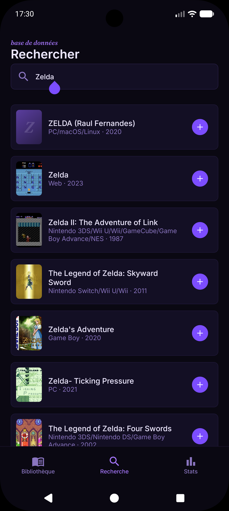
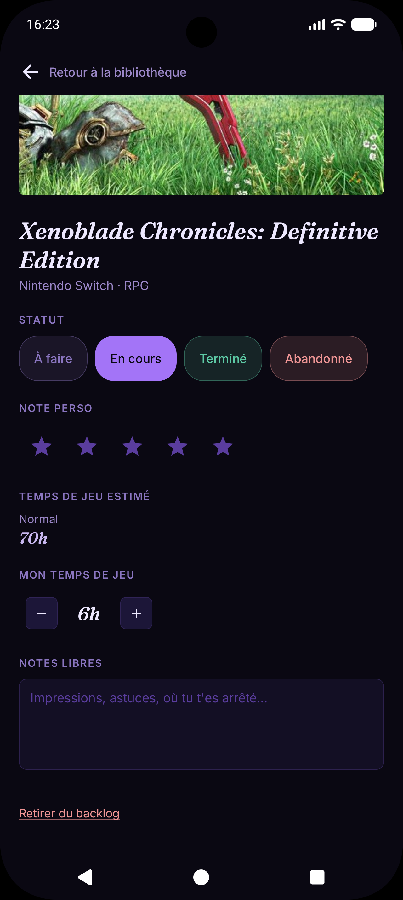
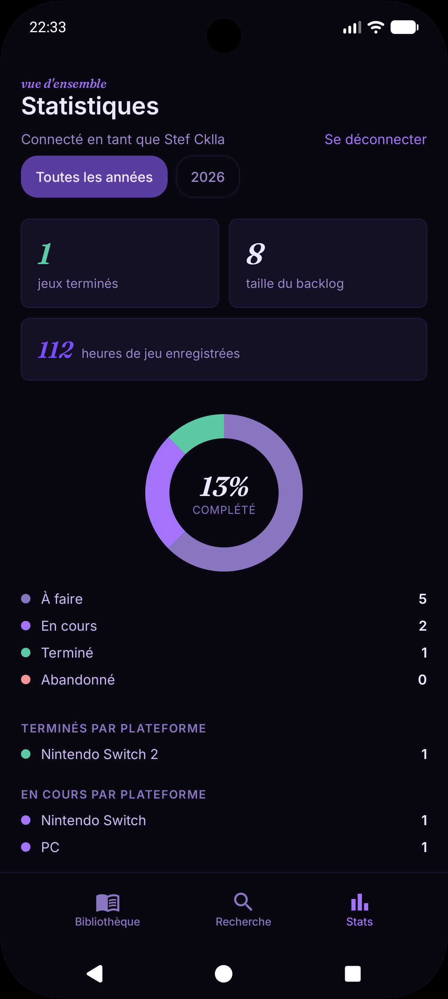

# Cartouche

Application Android personnelle de gestion de backlog de jeux vidéo : suivez les jeux à faire, en
cours, terminés ou abandonnés, recherchez-en de nouveaux via l'API RAWG, et retrouvez votre backlog
synchronisé automatiquement entre tous vos appareils grâce à Firebase.

<!-- Bannière/logo optionnel :

-->

## Sommaire

- [Fonctionnalités](#fonctionnalités)
- [Captures d'écran](#captures-décran)
- [Stack technique](#stack-technique)
- [Architecture](#architecture)
- [Installation](#installation)
- [Configuration des règles Firestore](#configuration-des-règles-firestore)
- [Sécurité](#sécurité)
- [Tests](#tests)
- [Structure du projet](#structure-du-projet)
- [Choix techniques notables](#choix-techniques-notables)
- [Confidentialité](#confidentialité)
- [Licence](#licence)

## Fonctionnalités

- **Bibliothèque** : liste du backlog avec statut visuel (À faire / En cours / Terminé /
  Abandonné), tri et filtrage.
- **Recherche** : recherche de jeux via l'[API RAWG](https://rawg.io/apidocs) (titre, jaquette,
  année de sortie) et ajout en un tap au backlog.
- **Fiche détail** : édition du statut, de la note personnelle, du temps de jeu personnel et de
  notes libres ; affichage du temps de jeu estimé (rapide / normal / complet) récupéré
  automatiquement depuis [IGDB](https://www.igdb.com/api).
- **Statistiques** : vue d'ensemble de la progression du backlog (répartition par statut, temps de
  jeu cumulé, etc.).
- **Connexion Google** : authentification obligatoire (Firebase Auth) pour identifier
  l'utilisateur et sécuriser ses données côté cloud.
- **Synchronisation multi-appareils** : le backlog est mirroré en continu entre l'appareil (Room)
  et Firebase Firestore. Un backlog local déjà existant est automatiquement uploadé lors de la
  toute première connexion. L'application reste utilisable hors-ligne : Room fait toujours foi
  pour l'affichage, Firestore synchronise en arrière-plan dès que le réseau est disponible.

## Captures d'écran

| Connexion | Bibliothèque | Recherche |
|:---:|:---:|:---:|
|  |  |  |

| Détail | Statistiques |
|:---:|:---:|
|  |  |

## Stack technique

| Domaine | Choix |
|---|---|
| Langage | Kotlin 2.2 |
| UI | Jetpack Compose (BOM 2026.02.01) |
| Navigation | Navigation Compose |
| Persistance locale | Room 2.8 |
| Réseau | Retrofit 3 + Moshi (RAWG, IGDB) |
| Injection de dépendances | Hilt |
| Cloud | Firebase Firestore (données) + Firebase Auth (Google Sign-In) |
| Chargement d'images | Coil |
| Tests | JUnit4 + kotlinx-coroutines-test, tests unitaires basés sur des fakes (pas de mock ni Robolectric) |

## Architecture

Architecture **MVVM**, avec le Repository comme unique source de vérité orchestrant Room et
Firebase :

```
UI (Compose)
   ↕ StateFlow / UiState
ViewModel
   ↕
Repository (source de vérité unique)
   ↙                              ↘
Room (cache local, offline)      Firebase Firestore/Auth (sync distante)
                                  Retrofit/Moshi (recherche RAWG, temps de jeu IGDB)
```

- Les ViewModels n'accèdent jamais directement à Retrofit, Room ou Firebase — toujours via une
  interface de repository (`domain/repository/`), injectée par Hilt.
- **Room** reste la seule source lue par l'UI (`observeGames()`), même en ligne : ça garantit un
  affichage instantané et un fonctionnement hors-ligne complet.
- **Firestore** fait autorité sur le contenu du backlog dès qu'un compte est connecté : il est
  écouté en temps réel et mirroré dans Room (ajouts/suppressions distants répercutés localement).
  Les écritures locales (ajout/modification/suppression) sont appliquées à Room en premier, puis
  répercutées vers Firestore en best-effort (un échec réseau n'empêche jamais l'écriture locale ;
  le SDK Firestore gère lui-même la persistance et la synchronisation différée hors-ligne).
- **Bootstrap** : à la toute première connexion d'un utilisateur dont la collection Firestore est
  vide, le backlog local existant est uploadé automatiquement — utile pour ne pas perdre les
  données d'un utilisateur qui utilisait déjà l'app avant l'introduction de la synchro.
- Erreurs réseau/Firebase remontées du Repository sous forme d'erreurs structurées
  (`Resource.Success` / `Resource.Error`), traduites en message utilisateur côté UI.

## Installation

### Prérequis

- Android Studio (dernière version stable) avec JDK 17+.
- Un appareil ou émulateur Android en API 24 (Android 7.0) ou supérieur.
- Un compte [RAWG](https://rawg.io/apidocs) (clé API gratuite).
- Un compte [Twitch Developer](https://dev.twitch.tv/console/apps) (pour l'authentification à
  l'API IGDB).
- Un projet [Firebase](https://console.firebase.google.com/) avec Firestore et l'authentification
  Google Sign-In activés.

### 1. Cloner le projet

```bash
git clone https://github.com/Cklla/Cartouche
cd Cartouche
```

### 2. Configurer les clés API

Créer un fichier `local.properties` à la racine du projet (ignoré par git) avec :

```properties
sdk.dir=/chemin/vers/le/sdk/android

RAWG_API_KEY=votre_clé_rawg
IGDB_CLIENT_ID=votre_client_id_twitch
IGDB_CLIENT_SECRET=votre_client_secret_twitch
```

### 3. Configurer Firebase

1. Dans la [console Firebase](https://console.firebase.google.com/), créer un projet et y ajouter
   une application Android avec le package `fr.cklla.cartouche`.
2. Activer **Firestore Database** et le fournisseur **Google** dans **Authentication**.
3. Renseigner l'empreinte SHA-1 du keystore de debug (`./gradlew signingReport`) dans les
   paramètres de l'application Android sur la console Firebase — requis par Google Sign-In.
4. Télécharger le fichier `google-services.json` généré et le placer dans `app/` (ignoré par git).
5. Activer **App Check** (onglet dédié de la console Firebase), enregistrer l'app avec le
   fournisseur **Play Integrity**. Au premier lancement en debug, un jeton s'affiche dans logcat :
   à déclarer dans App Check → l'app Android → menu **⋮** → *Gérer les jetons de débogage*, sans
   quoi les builds de debug seront rejetés dès qu'App Check passera en mode appliqué.

### 4. Compiler et lancer

```bash
./gradlew assembleDebug
```

ou directement depuis Android Studio (Run ▶).

## Configuration des règles Firestore

Les règles de sécurité (`firestore.rules`, versionnées dans ce dépôt) restreignent chaque
utilisateur à ses propres données et valident la forme de chaque document écrit (champs
autorisés, types, bornes numériques) — voir le fichier pour le détail, il fait foi.

À publier depuis l'onglet **Firestore Database → Règles** de la console Firebase (copier/coller le
contenu du fichier, puis **Publier**).

## Sécurité

- **Règles Firestore** : accès restreint à `users/{uid}/...` où `uid` est celui de l'utilisateur
  authentifié, et validation stricte des documents écrits (voir ci-dessus).
- **Firebase App Check** : chaque appel à Firestore/Auth est accompagné d'un jeton attestant que la
  requête vient bien de cette app installée sur un appareil légitime (fournisseur **Play Integrity**
  en release, fournisseur de debug en développement) — empêche l'utilisation du projet Firebase
  depuis un script ou une app reconstruite à partir du binaire.
- **`allowBackup="false"`** : aucune donnée locale (base Room, session Firebase, jeton IGDB) ne part
  dans une sauvegarde Google Drive ni un transfert d'appareil.
- **R8 + shrinking des ressources en release** : code réduit et obfusqué, ressources inutilisées
  retirées.
- **Jaquettes en HTTPS uniquement** : toute URL d'image reçue d'une API externe est vérifiée avant
  affichage.

## Tests

```bash
./gradlew testDebugUnitTest
```

Les tests unitaires couvrent les ViewModels et le Repository (logique de synchro Firestore ↔ Room,
mapping Firestore, gestion d'erreurs) via des implémentations *fake* des dépendances (pas de
mocking ni de Robolectric), pour des tests rapides et déterministes.

## Structure du projet

```
app/src/main/java/fr/cklla/cartouche/
├── data/
│   ├── local/          # Room : entités, DAO, base de données
│   ├── remote/
│   │   ├── dto/        # Réponses API RAWG
│   │   ├── firestore/  # Source de données Firestore + mapping
│   │   └── igdb/       # Client IGDB (auth Twitch, temps de jeu estimé)
│   └── repository/     # Implémentations concrètes des repositories
├── di/                  # Modules Hilt
├── domain/
│   ├── model/           # Modèles métier (Game, GameStatus, Resource, AuthUser…)
│   └── repository/      # Interfaces de repository
└── ui/
    ├── bibliotheque/    # Écran Bibliothèque
    ├── detail/          # Écran Détail d'un jeu
    ├── login/           # Écran de connexion Google
    ├── recherche/       # Écran Recherche RAWG
    ├── stats/           # Écran Statistiques
    ├── navigation/       # Routes Navigation Compose
    └── theme/            # Thème Compose (couleurs, typographie)
```

## Choix techniques notables

- **RAWG plutôt qu'IGDB** pour la recherche de jeux : clé API simple, pas d'OAuth, suffisant pour
  un usage personnel. IGDB est utilisé en complément uniquement pour le temps de jeu estimé
  (donnée plus fiable sur ce point précis).
- **UUID plutôt qu'identifiant auto-incrémenté** pour `Game.id` : le même identifiant désigne le
  même jeu sur Room et sur Firestore, sans table de correspondance séparée.
- **Room comme unique source lue par l'UI**, même en ligne : garantit un affichage instantané et
  un fonctionnement hors-ligne complet, Firestore ne faisant que mirrorer en arrière-plan.
- **Connexion Google obligatoire** dès le lancement : simplifie les règles de sécurité Firestore
  (un utilisateur = un espace de données) sans avoir à gérer de mot de passe dédié.

## Confidentialité

Voir [PRIVACY.md](PRIVACY.md) pour le détail des données traitées (compte Google, backlog) et de
leur usage.

## Licence

Projet personnel — usage privé.
