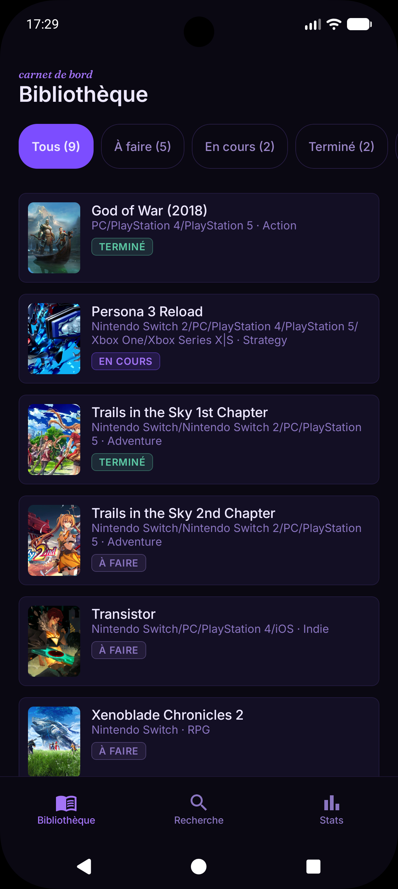
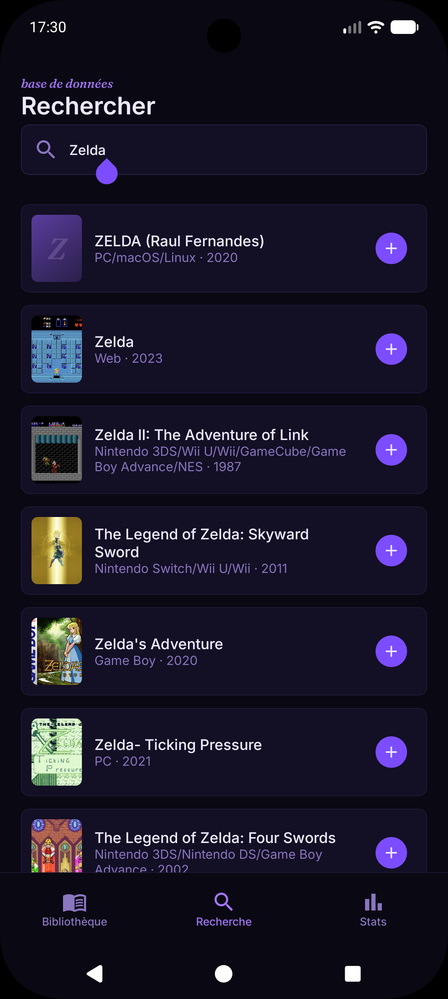
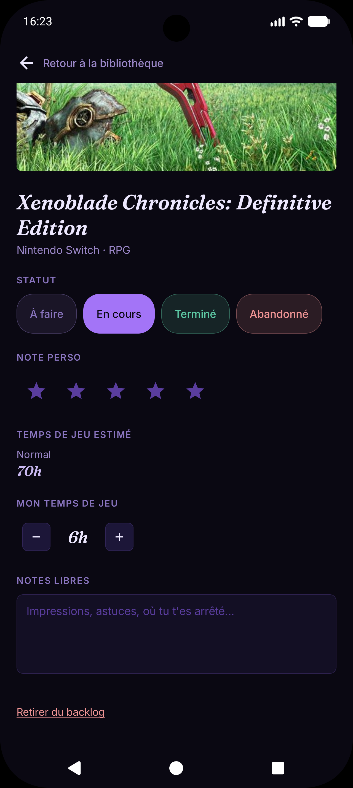
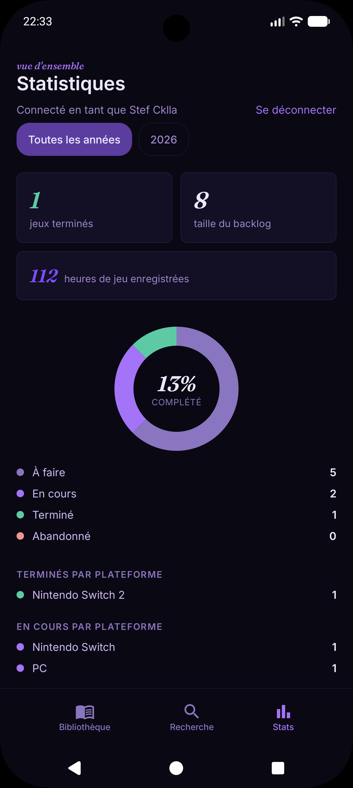
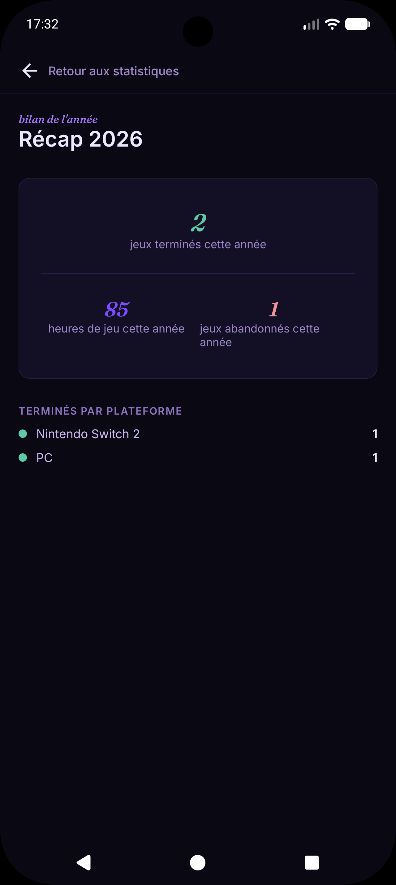
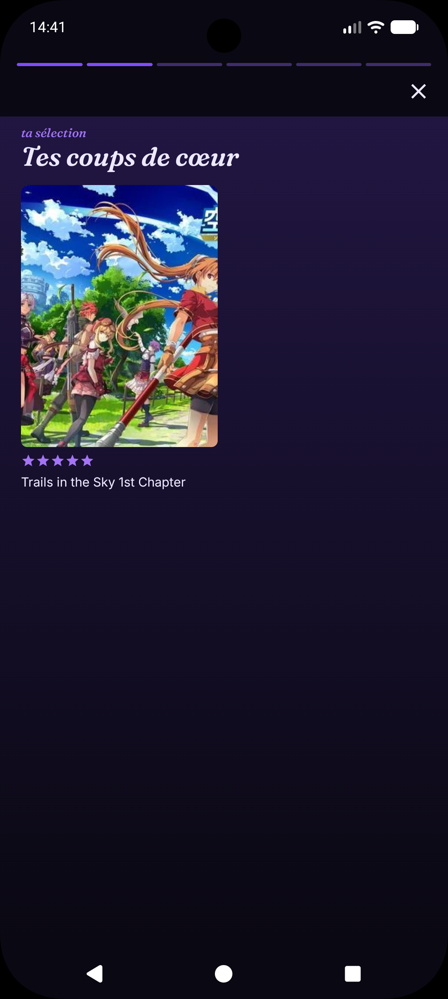
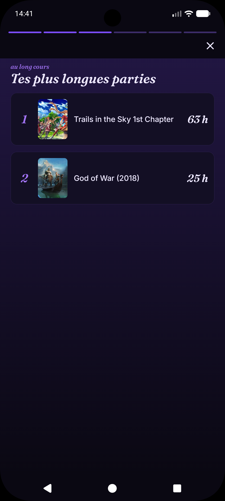
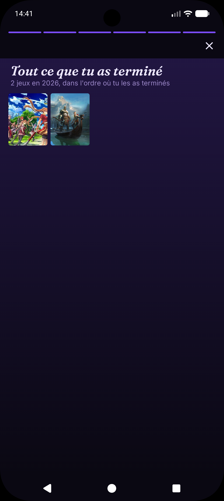

# Cartouche

Application Android personnelle de gestion de backlog de jeux vidéo : suivez les jeux à faire, en
cours, terminés ou abandonnés, recherchez-en de nouveaux via l'API RAWG, et retrouvez votre backlog
synchronisé automatiquement entre tous vos appareils grâce à Firebase.

## Fonctionnalités

- **Bibliothèque** : liste du backlog avec statut visuel (À faire / En cours / Terminé /
  Abandonné), tri et filtrage.
- **Recherche** : recherche de jeux via l'[API RAWG](https://rawg.io/apidocs), ajout en un tap au
  backlog.
- **Fiche détail** : statut, note personnelle, temps de jeu personnel, notes libres, temps de jeu
  estimé via [IGDB](https://www.igdb.com/api), et plateformes « Joué sur » pour un jeu
  multi-plateforme.
- **Plateforme fiabilisée via IGDB** : distingue Switch et Switch 2, regroupe Windows/Mac/Linux sous
  « PC ».
- **Année de fin ou d'abandon** : depuis la fiche d'un jeu Terminé ou Abandonné, on choisit l'année,
  y compris pour un jeu qui n'en avait aucune.
- **Statistiques** : progression du backlog par statut, temps de jeu cumulé, répartition par
  plateforme, filtre par année pour les jeux terminés et abandonnés.
- **Récap annuel** : bilan de l'année (jeux terminés, heures de jeu) du 25 décembre au 31 janvier,
  avec une notification locale une fois par an.
- **Récap en images** : suite de slides façon *Wrapped* (total, coups de cœur, plus longues parties,
  plateformes, faits de l'année, mosaïque des jaquettes).
- **Connexion Google et synchronisation** : backlog synchronisé entre appareils via Firestore,
  utilisable hors ligne.

## Captures d'écran

| Bibliothèque | Recherche | Détail |
|:---:|:---:|:---:|
|  |  |  |

| Statistiques | Récap annuel |
|:---:|:---:|
|  |  |

| Récap en images | Les jeux les plus longs | Mosaïque |
|:---:|:---:|:---:|
|  |  |  |

## Stack technique

| Domaine | Choix |
|---|---|
| Langage / UI | Kotlin 2.2, Jetpack Compose, Navigation Compose |
| Persistance locale | Room |
| Réseau | Retrofit 3 + Moshi (RAWG, IGDB) |
| Injection de dépendances | Hilt |
| Arrière-plan | WorkManager (notification du récap annuel) |
| Cloud | Firebase Firestore + Auth (Google Sign-In) |
| Images | Coil |
| Tests | JUnit4 + kotlinx-coroutines-test, avec des fakes (ni mock ni Robolectric) |

## Architecture

MVVM, avec le Repository comme source de vérité unique :

```
UI (Compose) ↔ ViewModel ↔ Repository ─┬─ Room (cache local, hors ligne)
                                       ├─ Firestore / Auth (synchro distante)
                                       └─ Retrofit (recherche RAWG, temps de jeu IGDB)
```

- Les ViewModels passent toujours par une interface de repository (`domain/repository/`), injectée
  par Hilt.
- **Room est la seule source lue par l'UI**, même en ligne : affichage instantané et usage hors
  ligne complet.
- Les écritures vont d'abord dans Room, puis vers Firestore en best-effort ; Firestore fait autorité
  sur le contenu dès qu'un compte est connecté et est mirroré dans Room.
- Les erreurs réseau et Firebase remontent sous forme de `Resource` structuré, traduit en message
  côté UI.

## Installation

**Prérequis** : Android Studio avec JDK 17+, un appareil ou émulateur en API 24 ou plus, une clé API
[RAWG](https://rawg.io/apidocs), une application [Twitch Developer](https://dev.twitch.tv/console/apps)
(authentification IGDB), un projet [Firebase](https://console.firebase.google.com/) avec Firestore
et Google Sign-In activés.

1. **Cloner** : `git clone https://github.com/Cklla/Cartouche`
2. **Clés API** : dans `local.properties` (ignoré par git) :
   ```properties
   sdk.dir=/chemin/vers/le/sdk/android
   RAWG_API_KEY=votre_clé_rawg
   IGDB_CLIENT_ID=votre_client_id_twitch
   IGDB_CLIENT_SECRET=votre_client_secret_twitch
   ```
3. **Firebase** : créer une application Android `fr.cklla.cartouche`, activer Firestore et le
   fournisseur Google d'Authentication, déclarer le SHA-1 du keystore de debug
   (`./gradlew signingReport`), puis placer `google-services.json` dans `app/` (ignoré par git).
4. **App Check** : enregistrer l'app avec **Play Integrity**. En debug, le jeton affiché dans logcat
   se déclare dans *App Check → l'app → ⋮ → Gérer les jetons de débogage*.
5. **Règles Firestore** : copier `firestore.rules` dans *Firestore Database → Règles* et publier.
   Chaque utilisateur n'accède qu'à ses données, et la forme de chaque document est validée.
6. **Lancer** : `./gradlew assembleDebug`, ou Run ▶ dans Android Studio.

## Tests

```bash
./gradlew testDebugUnitTest
```

Les tests couvrent les ViewModels, les repositories (synchro Firestore ↔ Room, mapping, erreurs) et
la logique pure (récaps, années), avec des fakes pour rester rapides et déterministes.

## Structure du projet

```
app/src/main/java/fr/cklla/cartouche/
├── data/           # Room, clients distants (RAWG, IGDB, Firestore), repositories
├── di/             # Modules Hilt
├── domain/         # Modèles, interfaces de repository, logique pure
├── notification/   # Notification locale du récap annuel
└── ui/             # Écrans Compose, navigation, thème
```

## Choix techniques notables

- **RAWG pour la recherche, IGDB en complément** : RAWG est simple (clé API, pas d'OAuth) ; IGDB est
  plus fiable pour le temps de jeu estimé et la plateforme.
- **UUID pour `Game.id`** : le même identifiant côté Room et Firestore, sans table de correspondance.
- **Connexion Google obligatoire** : un utilisateur = un espace de données, sans mot de passe dédié.
- **Notification locale, sans FCM** : un job WorkManager décide d'après la date de l'appareil.
- **Statistiques et récaps calculés en direct** à partir des données déjà stockées, par des
  fonctions pures : rien de plus à synchroniser.

## Confidentialité

Voir [PRIVACY.md](PRIVACY.md).

## Licence

Projet personnel — usage privé.
